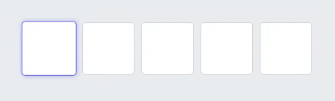

# 📟 React PIN Field [](https://github.com/soywod/react-pin-field/actions/workflows/tests.yml) [](https://app.codecov.io/gh/soywod/react-pin-field) [](https://www.npmjs.com/package/react-pin-field)

React component for entering PIN codes



*Live demo available at <https://soywod.github.io/react-pin-field/>.*

## Features

- Written in TypeScript, tested with Jest and Cypress
- Relies on `onchange` native event with minimum interaction for better browser compatibility
- Supports HTML [`dir`](https://developer.mozilla.org/en-US/docs/Web/HTML/Global_attributes/dir) left-to-right and right-to-left
- Supports HTML [`autofocus`](https://developer.mozilla.org/en-US/docs/Web/HTML/Global_attributes/autofocus) by focusing either the first or the last input, depending on `dir`
- Supports [ARIA](https://developer.mozilla.org/en-US/docs/Web/Accessibility/ARIA) attributes like `aria-required`, `aria-label`…
- Supports [key composition](https://developer.mozilla.org/en-US/docs/Web/API/Element/compositionstart_event)

## Installation

```
npm install react-pin-field
```

## Usage

```typescript
import PinField from "react-pin-field";
```

### Props

```typescript
// React PIN Field inherits native props from HTMLInputElement,
// except few event handlers that are overriden:
type NativeProps = Omit<
  InputHTMLAttributes<HTMLInputElement>,
  "onChange" | "onKeyDown" | "onCompositionStart" | "onCompositionEnd"
>;

type Props = NativeProps & {
  length?: number;
  format?: (char: string) => string;
  formatAriaLabel?: (index: number, total: number) => string;
  onChange?: (value: string) => void;
  onComplete?: (value: string) => void;  
};
```

#### `length`

The length of the PIN field, which represents the number of inputs.

*Defaults to `5`*

#### `format`

Characters can be formatted with any function of type `(char: string) => string`.

*Defaults to identity function `char => char`*

#### `formatAriaLabel`

This function is used to generate accessible labels for each input within the `<PinField />`. By default it renders the string `PIN field 1 of 6`, `PIN field 2 of 6`, etc., depending on the actual index of the input field and the total length of the pin field.

You can customize the `aria-label` string by passing your own function. This can be useful for: i) site internationalisation (i18n); ii) simply describing each input with different semantics than the ones provided by `react-pin-field`.

*Defaults to `(n, total) => "PIN field ${n} of ${total}"`*

#### `onChange`

This function is called everytime the PIN field changes its value.

#### `onComplete`

This function is called everytime the PIN field is completed. A PIN field is considered complete when:

- Every input has a defined value
- Every input passed the standard HTML validation (`required`, `pattern` etc)

#### Reference

React PIN Field exposes a special reference which is an array of `HTMLInputElement`:

```tsx
const ref = useRef<HTMLInputElement[]>();

<PinField ref={ref} />;

// focus the third input
ref.current[2].focus();
```

#### Style

React PIN Field can be styled either with `style` or `className`. This last one allows you to use pseudo-classes like `:nth-of-type`, `:focus`, `:hover`, `:valid`, `:invalid`…

### Hook

By default, React PIN Field is an [uncontrolled](https://react.dev/learn/sharing-state-between-components#controlled-and-uncontrolled-components) component, which means that its internal state cannot be changed. You can only listen to changes via `onChange` and `onComplete`.

To control the React PIN Field state, you can use the `usePinField()` custom hook:

```tsx
const handler = usePinField();

// The handler exposes a value and setValue to control the PIN code,
// as well as a state and dispatch for advanced usage.

// Let know the PIN field that you want to use this custom state
// instead of its internal one.
return <PinField handler={handler} />
```

*See the controlled section of the [live demo](https://soywod.github.io/react-pin-field/?path=/story/pinfield--controlled).*

## Contributing

*See the [Contributing guide](./CONTRIBUTING.md).*

## Sponsoring

If you appreciate the project, feel free to donate using one of the following providers:

[](https://github.com/sponsors/soywod)
[](https://ko-fi.com/soywod)
[](https://www.buymeacoffee.com/soywod)
[](https://liberapay.com/soywod)
[![thanks.dev](https://img.shields.io/badge/-thanks.dev-000000?logo=data:image/svg+xml;base64,PHN2ZyB3aWR0aD0iMjQuMDk3IiBoZWlnaHQ9IjE3LjU5NyIgY2xhc3M9InctMzYgbWwtMiBsZzpteC0wIHByaW50Om14LTAgcHJpbnQ6aW52ZXJ0IiB4bWxucz0iaHR0cDovL3d3dy53My5vcmcvMjAwMC9zdmciPjxwYXRoIGQ9Ik05Ljc4MyAxNy41OTdINy4zOThjLTEuMTY4IDAtMi4wOTItLjI5Ny0yLjc3My0uODktLjY4LS41OTMtMS4wMi0xLjQ2Mi0xLjAyLTIuNjA2di0xLjM0NmMwLTEuMDE4LS4yMjctMS43NS0uNjc4LTIuMTk1LS40NTItLjQ0Ni0xLjIzMi0uNjY5LTIuMzQtLjY2OUgwVjcuNzA1aC41ODdjMS4xMDggMCAxLjg4OC0uMjIyIDIuMzQtLjY2OC40NTEtLjQ0Ni42NzctMS4xNzcuNjc3LTIuMTk1VjMuNDk2YzAtMS4xNDQuMzQtMi4wMTMgMS4wMjEtMi42MDZDNS4zMDUuMjk3IDYuMjMgMCA3LjM5OCAwaDIuMzg1djEuOTg3aC0uOTg1Yy0uMzYxIDAtLjY4OC4wMjctLjk4LjA4MmExLjcxOSAxLjcxOSAwIDAgMC0uNzM2LjMwN2MtLjIwNS4xNTYtLjM1OC4zODQtLjQ2LjY4Mi0uMTAzLjI5OC0uMTU0LjY4Mi0uMTU0IDEuMTUxVjUuMjNjMCAuODY3LS4yNDkgMS41ODYtLjc0NSAyLjE1NS0uNDk3LjU2OS0xLjE1OCAxLjAwNC0xLjk4MyAxLjMwNXYuMjE3Yy44MjUuMyAxLjQ4Ni43MzYgMS45ODMgMS4zMDUuNDk2LjU3Ljc0NSAxLjI4Ny43NDUgMi4xNTR2MS4wMjFjMCAuNDcuMDUxLjg1NC4xNTMgMS4xNTIuMTAzLjI5OC4yNTYuNTI1LjQ2MS42ODIuMTkzLjE1Ny40MzcuMjYuNzMyLjMxMi4yOTUuMDUuNjIzLjA3Ni45ODQuMDc2aC45ODVabTE0LjMxNC03LjcwNmgtLjU4OGMtMS4xMDggMC0xLjg4OC4yMjMtMi4zNC42NjktLjQ1LjQ0NS0uNjc3IDEuMTc3LS42NzcgMi4xOTVWMTQuMWMwIDEuMTQ0LS4zNCAyLjAxMy0xLjAyIDIuNjA2LS42OC41OTMtMS42MDUuODktMi43NzQuODloLTIuMzg0di0xLjk4OGguOTg0Yy4zNjIgMCAuNjg4LS4wMjcuOTgtLjA4LjI5Mi0uMDU1LjUzOC0uMTU3LjczNy0uMzA4LjIwNC0uMTU3LjM1OC0uMzg0LjQ2LS42ODIuMTAzLS4yOTguMTU0LS42ODIuMTU0LTEuMTUydi0xLjAyYzAtLjg2OC4yNDgtMS41ODYuNzQ1LTIuMTU1LjQ5Ny0uNTcgMS4xNTgtMS4wMDQgMS45ODMtMS4zMDV2LS4yMTdjLS44MjUtLjMwMS0xLjQ4Ni0uNzM2LTEuOTgzLTEuMzA1LS40OTctLjU3LS43NDUtMS4yODgtLjc0NS0yLjE1NXYtMS4wMmMwLS40Ny0uMDUxLS44NTQtLjE1NC0xLjE1Mi0uMTAyLS4yOTgtLjI1Ni0uNTI2LS40Ni0uNjgyYTEuNzE5IDEuNzE5IDAgMCAwLS43MzctLjMwNyA1LjM5NSA1LjM5NSAwIDAgMC0uOTgtLjA4MmgtLjk4NFYwaDIuMzg0YzEuMTY5IDAgMi4wOTMuMjk3IDIuNzc0Ljg5LjY4LjU5MyAxLjAyIDEuNDYyIDEuMDIgMi42MDZ2MS4zNDZjMCAxLjAxOC4yMjYgMS43NS42NzggMi4xOTUuNDUxLjQ0NiAxLjIzMS42NjggMi4zNC42NjhoLjU4N3oiIGZpbGw9IiNmZmYiLz48L3N2Zz4=)](https://thanks.dev/soywod)
[](https://www.paypal.com/paypalme/soywod)
